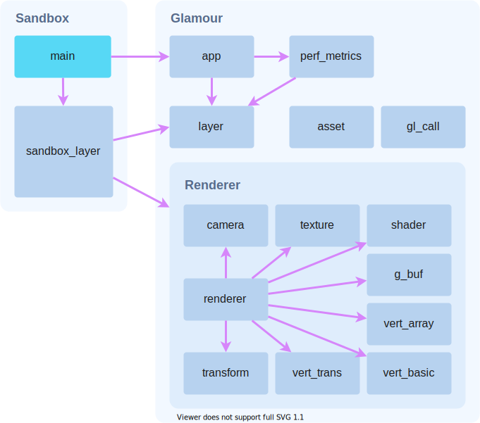

# Architecture

## Modules

### Overview
Rust's module system provides an easy way to group code for readability, reuse, and privacy. The boxes in **Figure 1** are derivitive of the directory structure of the source code, with important modules having further explanation following.

The application is split into two main projects:
- **Sandbox**: a binary application to run and demonstrate the Glamour library.
- **Glamour**: a library project containing all the rendering functionality.

**Figure 1:** A simplified module and dependency graph for the application.

### app
The app module is responsible for managing the window, event loop, and OpenGL context. This is where layers are stored and processed.

### layer
A layer is a trait (like an interface) that can handle events and do things on update loops.

### asset
This module provides a way to load files from the `assets` folder, which is copied relative to the executable on build.

### gl_call
Since all the OpenGL functions are inherently _unsafe_, the `gl_call!` macro will wrap a function and _panic_ if it errors, making OpenGL much easier to use.

### renderer
This is what actually makes the draw calls. The renderer also manages the shaders, vertex arrays, and G-buffer, amongst other things.

## Sandbox
The Sandbox project initialises an **app** instance and attaches a **sandbox_layer** to it. The **sandbox_layer** is responsible for instructing the **renderer** what to render, e.g., _render 10,000 cubes at these randomly seeded positions from this camera angle_.
