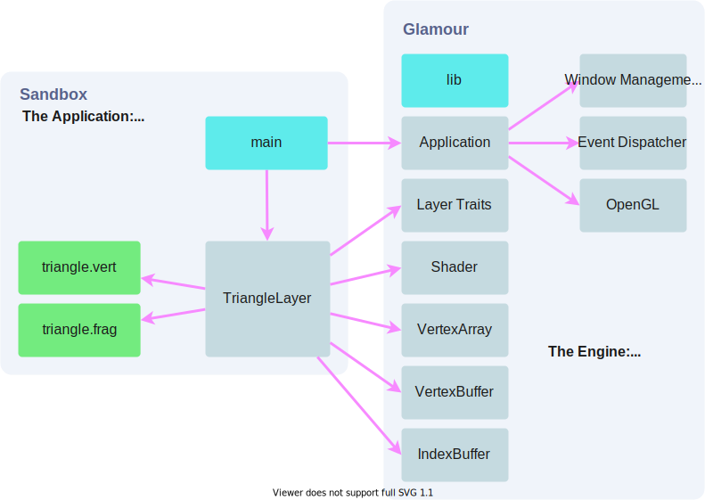

# Technical Report <Badge text="WIP"/>

[[toc]]

TODO:
- skim through all rendering notes
- rough out the structure of the project
- slowly explain the finer details as they solidify

## Technology

- Rust (latest)
- OpenGL (4.1+)

## Foundation

- gl - unsafe bindings to raw OpenGL calls.
- glutin - manages window, events, and OpenGL context.
- imgui - immediate mode GUI for tooling and development.
- nalgebra-glm - math library for graphics programming.

## Architecture

**Figure 1:** A notional module and dependency graph for the software.