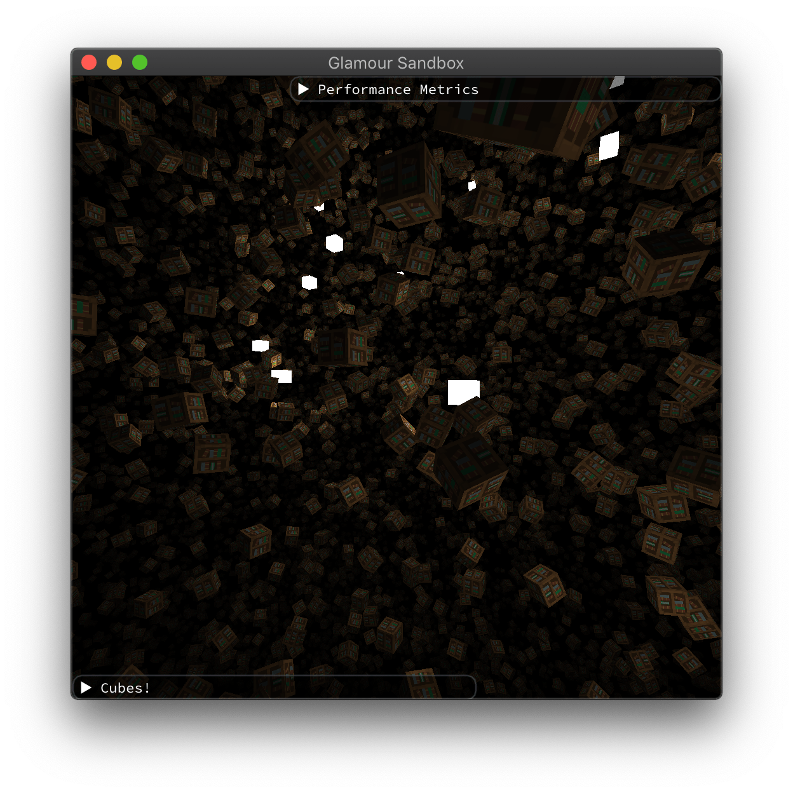
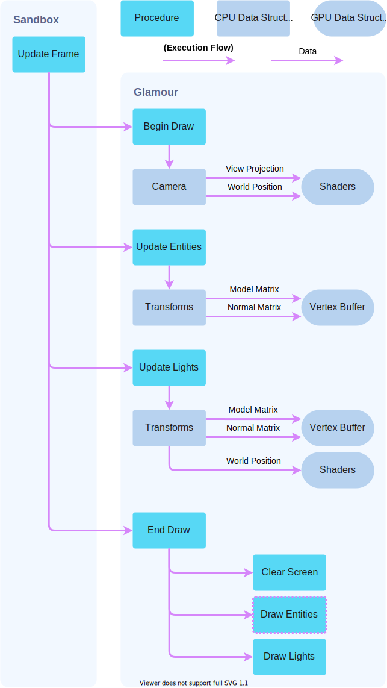

# Renderer 🚧

Details on the rendering pipeline, how OpenGL is used, and performance metrics.
use lots of pictures here, it's the main visual element.

## Pipeline

### Overview

**Figure 2:** Running the application results in the scene above . A bunch of rotating cubes, with lights travelling around the world.

**Figure 3:** The general rendering pipeline. `Draw Entities` is where the difference between forward and deferred is managed.

- diagram of the rendering pipeline
- diagram of data structures of `renderer` and `SandboxLayer`

### Forward
asdf

### Deferred
asdf

## OpenGL
abstracting OpenGL and error handling, `gl_call`.

## MVP Transforms

### Transform
asdf

### Camera
asdf

## Shaders

### Shader Builder
asdf

### Forward
asdf

### Deferred
asdf

## Vertex Arrays
asdf

## Meshes
asd

## Textures
asdf
